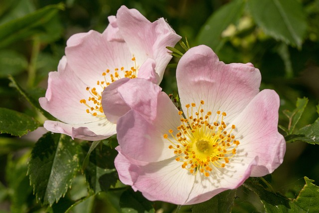

# BerryBloomID

This application uses image classification to identify flower and berry species from Alberta Canada using a fine-tuned
[ViT](https://huggingface.co/google/vit-base-patch16-224) deep learning model.

Alberta is known as wild rose country hosting a wide range of diverse wild flowers and berry bushes during the summer months. I myself
am an avid hiker and outdoorsman but find it difficult to identify many plant species due to their vast diversity. For instance, many bushes
harbour edible berries that could provide a nice snack during a long hike. However, some berries are poisonous and should be avoided!
Learning to identify these wild flowers and berries is an excellent skill that promotes the appreciation of the plant species growing
in the Rocky Mountains of Alberta! BertaBloomID will make this an easier task by providing quick and easy identifications through photos!

## Dataset generation
The ViT model will be fine-tuned with supervised learning using labelled images of flower and berries from Alberta Canada. The plant species
names were obtained from the [USDA Plants Database](https://plants.usda.gov/home) by filtering for mono and dicot species in Alberta, which
resulted in a list of 916 different plant species.

### Image downloading
Labelled images were obtained with web scraping via the *BingImageCrawler* from the
[icrawler](https://icrawler.readthedocs.io/en/latest/index.html) Python library. For each plant species, 50 images were downloaded using
parallel processing resulting in ~46,000 images.

### Data processing
The ViT image classification model is a neural network developed by Google and was pretained on 21 million images with a resolution of 224x224.
To input images into this model for fine-tuning, the downloaded images were resized to the same resolution. Additionally, all images were
converted into *.jpg* format to save space and maintain consistency.

### Train and test split
The file paths of all sampled images along with their species name and class label were organized into a Pandas data frame. This data frame was
split into training and testing sets with a 0.8 split size. Both training and testing datasets were saved in *.csv* format for later training
and testing of the image classification model.

## Future directions and obstacles
This application is still in development and will continue until its final completion. Some tasks that will be completed in future include
training the ViT model on the generated image data. The main obstacle with model training is computer resources. This is a large model
that will be trained on thousands of images so both system and video memory are the bottlenecks. To overcome this, the model will be
trained on chunks of images rather than the entire dataset at once. After model training, the fine-tuned model will be tested for accuracy
and performance in classifying flower and berry images. Additionally, a web GUI will be created via *streamlit* allowing users to upload
and identify their plant images.
