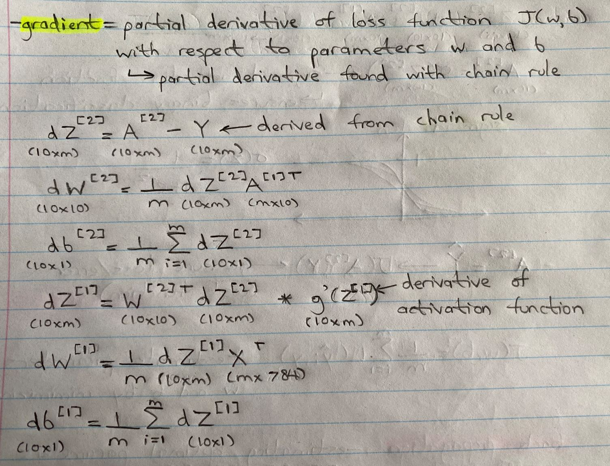

# Building a Neural Network (NN) from scratch

Libraries like *Tensorflow* and *PyTorch* are excellent resources to build neural networks (NN) for deep learning applications. However,
these pipelines abstract away a lot of details important for understanding how a NN works and the algorithm behind it. To demonstrate
how a NN works, I built my own 2-layer NN to classify images of numbers from the MNSIT dataset using only *numpy*.

## Dataset
The Modified National Institute of Standards and Technology (MNIST) is a database of images with handwritten digits commonly used
to train various image processing systems. It contains 60,000 training images and 10,000 testing images all normalized to
resolutions of 28x28 pixels. The dataset was obtained from [Kaggle](https://www.kaggle.com/datasets/oddrationale/mnist-in-csv)
in CSV format under an Open Data Commons license.

## Model training
The accuracy and loss during training are shown in the line plot below. The achieved training accuracy achieved over 1000 iterations
of gradient descent was ~90%.

Model training can be animated using Principle Component Analysis (PCA) as shown by the plot below. Over each iteration of gradient
descent the model decision boundaries are updated and changed to mimimize error and increase accuracy. The limitation with this
plot is that PCA cannot capture the full complexity of the dataset and only explains about ~17% of the dataset variability. This is why
the decision boundaries do not appear accurate nor converge to the appropriate data points. However, the changing decision boundaries
still demonstrate how the model is learning and changing in response to each iteration of gradient descent.

## Model testing
Model testing results can be summarized by the confusion matrix below. The large values within the diagonals of the heatmap indicate
that many of the predicted labels were the same as the true labels. The achieved testing accuracy of the neural network was 88.63%.

## Theory
The following section contains my notes to explain a neural network and how mine was constructed.

### Defining the training dataset
Each sample in the dataset are 28x28 images containing a total of 784 pixels. This results in 784 features to use for training.

### Network overview
The constructed network will be a 2-layer network containing an input layer of 784 nodes, one hidden layer with 10 nodes and one output
layer of 10 nodes. A NN is constructed through logistic regressions repeated many times. Each node completes a logistic regression
calculation with the goal of estimating the optimal weights and bias's for each node (w and b parameters).

### Forward propagation
#### Layer-1 (hidden layer) forward propagation
This hidden layer will use the *ReLU* activation function to estimate A[1], which is inputted into layer 2 of the network.

##### *Why are activation functions needed?*
An activation function allows the NN to learn complex non-linear patterns by introducing non-linear behaviours. If there was no
activation then each node would become a linear combination of the nodes before it making any hidden layers obsolete. The output
layer just becomes a linear combination of the input layer making it a fancy linear regression.

#### Layer-2 (output layer) forward propagation
The output layer will use the *sigmoid* activation function to ensure binary classification (ie. A[1] becomes either 0 or 1).
The cost function is then used to estimate loss or error of the current estimate from the real target variable Y.

### Back propagation
Estimating optimal parameters W[1], b[1], W[1], b[1] that minimize the error or loss.

Back propagation calculates the gradients (partial derivative of loss function with respect to W and b) in order to update the
model parameters.

### Update parameters
The model parameters are updated based on the gradients calculated from back propagation and the learning rate hyperparameter.

### Summary
Repeat these steps many times to estimate the optimal parameters W[1], b[1], W[1], b[1] that determine the neural
network model.
1. Forward propagation
2. Back propagation
3. Update parameters

